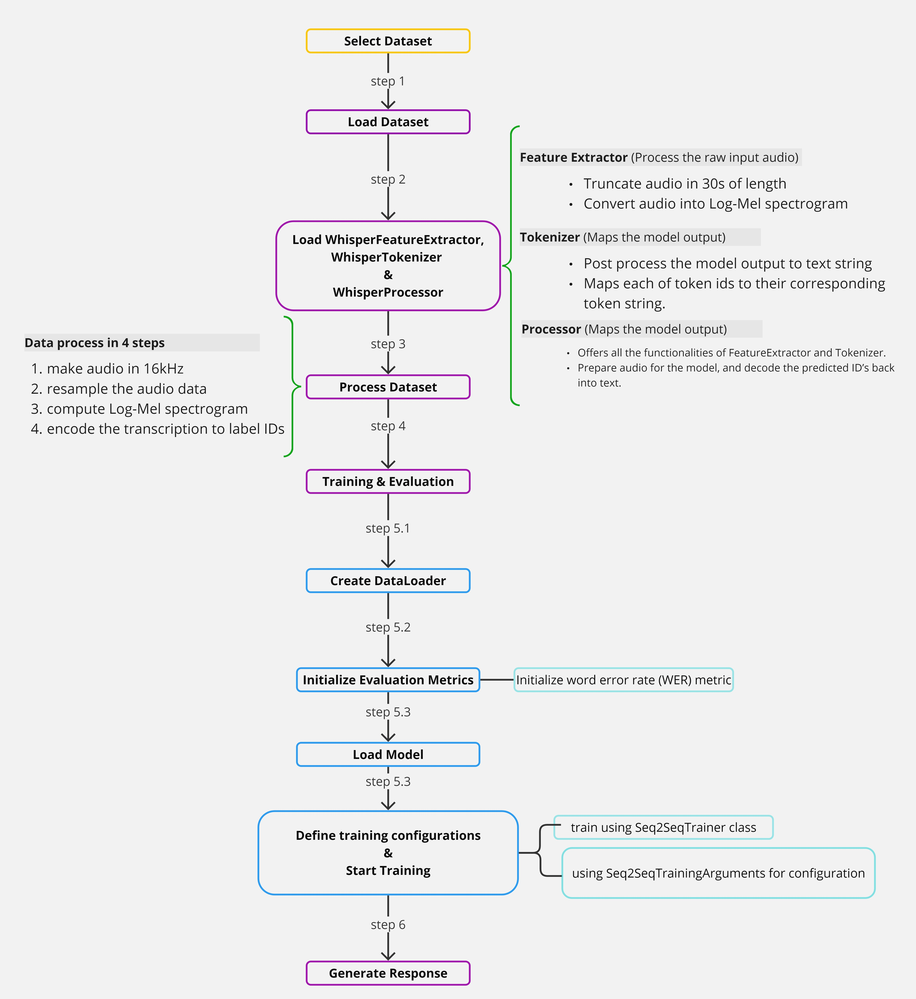

<h1>Whisper_Finetune</h1>

### Whisper Model Fine-Tuning Pipeline

This repository contains a streamlined pipeline for fine-tuning OpenAI's Whisper model on custom audio datasets. The pipeline has been designed for flexibility, efficiency, and ease of use, focusing on key steps required to train and evaluate a speech-to-text system.



---

#### Pipeline Overview

The fine-tuning pipeline consists of the following steps:

1. **Select Dataset**: Choose a dataset containing audio files and corresponding transcriptions for training.
2. **Load Dataset**: Load the dataset into a compatible format for preprocessing.
3. **Load Whisper Tools**: Initialize `WhisperFeatureExtractor`, `WhisperTokenizer`, and `WhisperProcessor`.
4. **Process Dataset**:
   - Resample audio data to 16 kHz.
   - Convert audio to log-Mel spectrograms.
   - Encode transcriptions into token IDs.
5. **Training and Evaluation**:
   - **DataLoader Creation**: Prepare the dataset for efficient batching.
   - **Metrics Initialization**: Use Word Error Rate (WER) as the evaluation metric.
   - **Load Model**: Load the pre-trained Whisper model for fine-tuning.
   - **Define Training Configurations**: Use `Seq2SeqTrainer` for training with `Seq2SeqTrainingArguments`.
6. **Generate Response**: Evaluate the fine-tuned model on test data and generate predictions.

---

#### Data Processing Details

The dataset is processed in the following steps:
1. Convert all audio files to 16 kHz.
2. Resample audio data.
3. Compute log-Mel spectrograms for model input.
4. Encode transcriptions into label IDs compatible with the tokenizer.

---

#### Prerequisites

- Python 3.8 or later
- [Hugging Face Transformers](https://huggingface.co/transformers/)
- `datasets` library for dataset loading
- GPU with CUDA support (recommended)

Install the required dependencies using:

```bash
pip install transformers datasets librosa evaluate jiwer gradio
```

---
### How to Use
#### Step 1: Clone the Repository
```
git clone https://github.com/sazzad1779/Whisper_Finetune.git
cd Whisper_Finetune
```
#### Step 2: Prepare the Dataset
Ensure your dataset is structured with audio files and corresponding transcriptions. Update the script to point to your dataset directory or Hugging Face dataset.

#### Step 3: Run the Pipeline
Modify and execute the training script:

``
python train.py
``
#### Step 4: Evaluate the Model
Once training is complete, run the evaluation script to calculate Word Error Rate (WER):

``
python evaluate.py
``
---
### Results
- The fine-tuned model achieves improved transcription accuracy on the custom dataset.
- Word Error Rate (WER) is used as the primary evaluation metric.
### Future Work
Add data augmentation for robustness.
Experiment with advanced evaluation metrics.
Extend the pipeline to handle multimodal tasks.

I'm delighted to provide a well-formatted essay on the current political situation in the USA. Please note that this response is based on information available up until my knowledge update in2023, and might not reflect very recent developments.
**Essay Format:** MLA Style**Title:** Current Political Situation in the United States of America**Date:** March2023**Author:** Athena2 (AI Assistant)---**Current Political Situation in the United States of America**The United States is facing a complex political landscape, influenced by a myriad of factors including policy shifts, party realignments, and the impact of global events. This essay delves into the current state of U.S. politics, examining recent developments, challenges, and their implications.**I. Introduction**As of early2023, the United States is experiencing a unique moment in its political history. With the nation's attention focused on recovery from the pandemic, economic shifts, and global events like the war in Ukraine, the current situation presents both opportunities for growth and challenges that demand immediate action.**II. The Current State: A Perspective**### **A. Executive and Legislative Branches' Interactions**The presidency of Joe Biden has been marked by efforts to rebuild the nation's infrastructure, strengthen healthcare systems, and promote climate change awareness. The Biden administration continues to grapple with challenges inherited from the previous administration, including immigration policies and economic stimulus packages.### **B. Senate and House Dynamics**The balance between the Democrats and Republicans in both houses of Congress has been crucial in shaping policy debates. Recent mid-term elections saw shifts in party composition within the House and Senate, indicating a potential for bipartite control or gridlock depending on the specific issue at hand.### **C. Judicial Branch: Supreme Court and Its Impacts**Recent Supreme Court decisions have influenced public opinion on topics such as gun laws, climate change, and digital privacy rights. Observers are keenly watching for future verdicts that could redefine national policy standards.**III. Challenges and Opportunities**- **1. Economic Shifts:** *Challenge*: Rising inflation, affecting lower-to-middle-income families. *Opportunity*: The Biden administration's push for green economy investments may open new job markets.- **2. Pandemic Recovery:* *Challenge*: Long-term impacts on mental health and the healthcare system. *Opportunity*: Innovation in telemedicine has provided unprecedented access to medical services.- **3. Global Events:* *Challenge*: The impact of sanctions on Russia due to its Ukraine policy. *Opportunity*: Aligning with other nations against global challenges like climate change may strengthen international bonds.**IV. Conclusion**In conclusion, the current political situation in the United States reflects both resilience and vulnerability, offering pathways for growth while highlighting the need for immediate policy adjustments. As America navigates these complexities, it is clear that its future depends on effective dialogue among executive, legislative, and judicial branches.**Bibliography:**1. *News Sources*: CNN, BBC, NPR2. *Books*: "The US Constitution: A Very Short Introduction" by Michael Gecoff---*Does this response meet your expectations? Is there a particular aspect of U.S. politics you'd like me to expand upon? Feel free to request more details or discuss any other topic!*
